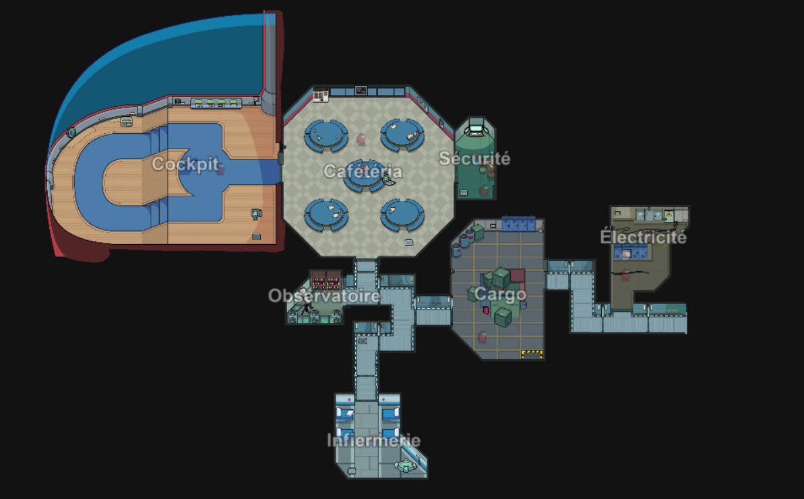

# 🚀 The Skeld Reimagined — Custom Map Project

## 🎮 Présentation du projet

**The Skeld Reimagined** est un projet de création d’une **map custom Among Us** inspirée de la célèbre map **The Skeld**.

Le but du projet est de recréer entièrement la map avec :

* 🏗️ De nouvelles zones
* 🎨 Une direction artistique personnalisée
* ⚡ Des mécaniques inédites
* 🔥 Une ambiance plus immersive
* 🧩 Des events et interactions uniques

Le développement est réalisé grâce au mod **Level Impostor**, permettant la création de maps personnalisées dans *Among Us*.

---

# 🖼️ Aperçu du projet



---

## ✨ Objectifs

Le projet vise à proposer une expérience différente de la map originale :

| Fonctionnalité               | Description                                       |
| ---------------------------- | ------------------------------------------------- |
| 🗺️ Nouvelle disposition     | Certaines salles seront déplacées ou redesignées  |
| 🔐 Systèmes interactifs      | Portes, events, animations et éléments dynamiques |
| 👀 Gameplay amélioré         | Nouveaux passages et stratégies possibles         |
| 🎵 Ambiance immersive        | Sons, lumières et décors personnalisés            |
| ⚙️ Compatibilité multijoueur | Jouable avec d'autres joueurs via le mod          |

---

# 🛠️ Technologies utilisées

* 🎮 **Among Us**
* 🧩 **Level Impostor Mod**
* 💻 Unity
* 🎨 Outils de mapping et de design

---

# 📸 Concept & Inspiration

La map reprend la base iconique de **The Skeld**, tout en ajoutant une identité totalement nouvelle.

Inspirations principales :

* Sci-fi futuriste
* Zones abandonnées
* Complexes industriels
* Stations spatiales modernes

---

# 📂 Structure du projet

```bash
📦 The BestSkeld
 ┣ 📂 Assets
 ┣ 📂 CustomRooms
 ┣ 📂 Textures
 ┣ 📂 Sounds
 ┣ 📂 Scripts
 ┗ 📜 README.md
```


## Release

|                                       Among Us Version                                        |  Version |                                        Links                                        |
|:---------------------------------------------------------------------------------------------:|:-----------------:|:-----------------------------------------------------------------------------------:|
|                                         `v2026.**.*.*`                                         |   `v2026.*.**`   | [À VENIR]() |


---

# 🧰 Télécharger les dépendances

Ce projet (comme dans les technoliges utilisées), nécéssite :

* 🗺️ [Level Imposter](https://github.com/DigiWorm0/LevelImposter/releases)
* 🛠️ [Reactor](https://github.com/NuclearPowered/Reactor) (déjà inclus dans Level Imposter)

---

# 🌐 TUTO INSTALLATION

- 1 Téléchargez la version ZIP correcte en fonction de votre version d'Among Us (dans [release](https://github.com/Isax820/TheSkeldReimagined#release))

- 2 Accedez au dossier où est installé Among Us :
  -  Steam : `C:\Program Files (x86)\Steam\steamapps\common\Among Us`
  -  Epic Games : `C:\Program Files\Epic Games\AmongUs`

- 3 Extrayez-y les fichiers téléchargés. Assurez-vous que le dossier se trouve dans le même dossier que le fichier (voir la capture d’écran ci-dessous). BepInExAmong Us.exe

- 4 Lancez le jeu (veuillez noter que le premier lancement peut prendre un certain temps)

⚠️ Alternativement, si vous utilisez déjà d’autres mods ou si vous avez déjà installé BepInEx, vous pouvez télécharger le fichier DLL directement et le placer dans .BepInEx/plugins


---

# 💬 Langues

| Langue               | ❔  |              Status               |
|-------------------------|:--:|:---------------------------------:|
| Français                | ✅  |         Entièrement traduit|
| Chinois              | ❌  |         Non traduit         |
| Anglais                | ❌  |         Non traduit        |
| Italien                 | ❌  |         Non traduit      |
| Espagnol                | ❌ |       Non traduit        |
| Portugais               | ❌  |         Non traduit      |

---

# 📢 Suivre le projet

Tu pourras suivre l’avancement du projet via :

* 💬 [Discord](https://discord.gg/ZdbJnysdrK)

---

# ⭐ Support

Si le projet te plaît :

* ⭐ Mets une étoile au repo
* 🍴 Fork le projet
* 🧠 Propose des idées
* 🐛 Report les bugs

---

# 🔥 Preview

> « Refaire The Skeld… mais en version totalement nouvelle. »

---

<p align="center">
  <b>🚀 The Skeld Reimagined Project 🚀</b>
</p>
